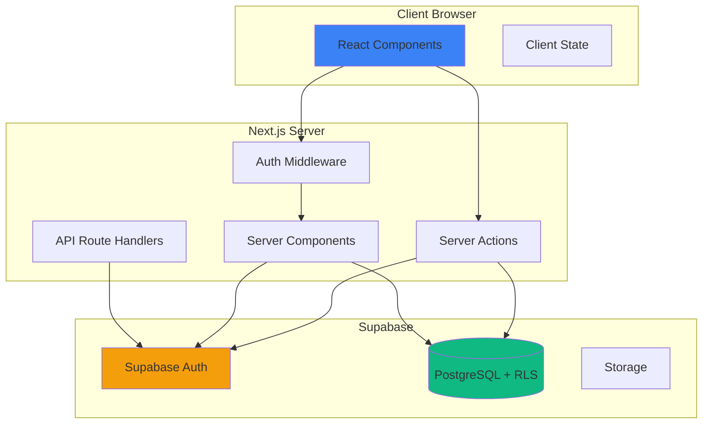
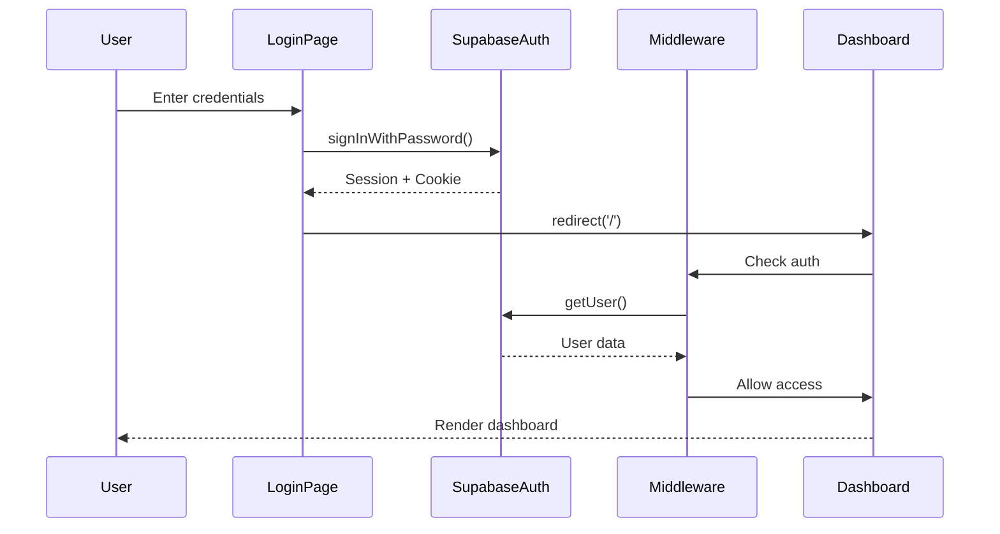
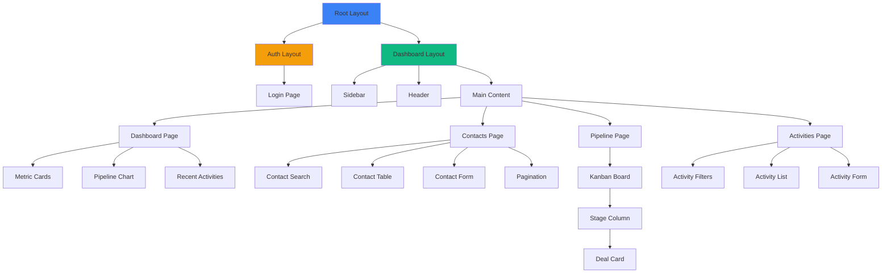

# Design Document: NexusCRM Frontend

## Overview

NexusCRM Frontend is a modern Customer Relationship Management web application built with Next.js 16 App Router, TypeScript, Tailwind CSS, shadcn/ui, and Supabase. The application provides a comprehensive interface for managing contacts, deals, pipeline stages, and activities with role-based access control enforced through Supabase Row Level Security (RLS).

### Key Design Principles

1. **Server-First Architecture**: Leverage Next.js Server Components for initial data fetching and Server Actions for mutations
2. **Type Safety**: Comprehensive TypeScript types derived from database schema
3. **Progressive Enhancement**: Core functionality works without JavaScript, enhanced with client-side interactivity
4. **Security by Default**: Authentication checks at multiple layers (middleware, server components, server actions)
5. **Performance**: Optimistic UI updates, streaming responses, and efficient data fetching patterns

### Technology Stack

- **Framework**: Next.js 16.2.6 with App Router
- **Language**: TypeScript 5 (strict mode)
- **Styling**: Tailwind CSS 4
- **UI Components**: shadcn/ui (Radix UI primitives)
- **Backend**: Supabase (PostgreSQL + Auth + Storage)
- **Form Management**: react-hook-form + zod
- **State Management**: React Server Components + URL state
- **Drag & Drop**: @dnd-kit/core

## Architecture

### High-Level Architecture



### Request Flow Patterns

#### 1. Initial Page Load (Server-Side Rendering)
```
User Request → Middleware (Auth Check) → Server Component → Supabase Query → HTML Response
```

#### 2. Form Submission (Server Action)
```
Form Submit → Server Action → Validation → Supabase Mutation → Revalidate → UI Update
```

#### 3. Client-Side Navigation
```
Link Click → Next.js Router → Prefetch → Server Component → Streaming Response
```

### Authentication Flow



## Components and Interfaces

### Folder Structure

```
nexus-crm/
├── src/
│   ├── app/
│   │   ├── (auth)/
│   │   │   ├── login/
│   │   │   │   └── page.tsx              # Login page
│   │   │   └── layout.tsx                # Auth layout (centered, no sidebar)
│   │   ├── (dashboard)/
│   │   │   ├── layout.tsx                # Dashboard layout (sidebar + header)
│   │   │   ├── page.tsx                  # Dashboard home
│   │   │   ├── contacts/
│   │   │   │   ├── page.tsx              # Contact list
│   │   │   │   ├── [id]/
│   │   │   │   │   └── page.tsx          # Contact detail
│   │   │   │   └── loading.tsx           # Loading state
│   │   │   ├── pipeline/
│   │   │   │   ├── page.tsx              # Kanban board
│   │   │   │   └── loading.tsx
│   │   │   └── activities/
│   │   │       ├── page.tsx              # Activity list
│   │   │       └── loading.tsx
│   │   ├── layout.tsx                    # Root layout
│   │   └── globals.css                   # Global styles
│   ├── components/
│   │   ├── ui/                           # shadcn/ui components
│   │   │   ├── button.tsx
│   │   │   ├── input.tsx
│   │   │   ├── card.tsx
│   │   │   ├── dialog.tsx
│   │   │   ├── form.tsx
│   │   │   ├── table.tsx
│   │   │   ├── select.tsx
│   │   │   ├── skeleton.tsx
│   │   │   └── ...
│   │   ├── layout/
│   │   │   ├── sidebar.tsx               # Navigation sidebar
│   │   │   ├── header.tsx                # Top header with user info
│   │   │   └── mobile-nav.tsx            # Mobile hamburger menu
│   │   └── features/
│   │       ├── contacts/
│   │       │   ├── contact-table.tsx     # Server component
│   │       │   ├── contact-form.tsx      # Client component
│   │       │   ├── contact-search.tsx    # Client component
│   │       │   └── contact-row.tsx       # Server component
│   │       ├── pipeline/
│   │       │   ├── kanban-board.tsx      # Client component
│   │       │   ├── deal-card.tsx         # Client component
│   │       │   └── stage-column.tsx      # Client component
│   │       ├── activities/
│   │       │   ├── activity-list.tsx     # Server component
│   │       │   ├── activity-form.tsx     # Client component
│   │       │   ├── activity-item.tsx     # Server component
│   │       │   └── activity-filters.tsx  # Client component
│   │       └── dashboard/
│   │           ├── metric-card.tsx       # Server component
│   │           ├── pipeline-chart.tsx    # Client component
│   │           └── recent-activities.tsx # Server component
│   ├── lib/
│   │   ├── supabase/
│   │   │   ├── client.ts                 # Browser client
│   │   │   ├── server.ts                 # Server component client
│   │   │   └── middleware.ts             # Middleware client
│   │   ├── validations/
│   │   │   ├── contact.ts                # Contact form schemas
│   │   │   ├── activity.ts               # Activity form schemas
│   │   │   └── deal.ts                   # Deal form schemas
│   │   └── utils.ts                      # Utility functions
│   ├── actions/
│   │   ├── contacts.ts                   # Contact CRUD actions
│   │   ├── deals.ts                      # Deal CRUD actions
│   │   ├── activities.ts                 # Activity CRUD actions
│   │   └── auth.ts                       # Auth actions
│   ├── types/
│   │   ├── database.ts                   # Database types
│   │   ├── supabase.ts                   # Supabase generated types
│   │   └── index.ts                      # Shared types
│   └── middleware.ts                     # Auth middleware
├── .env.local                            # Environment variables
├── next.config.ts
├── tsconfig.json
├── tailwind.config.ts
└── package.json
```

### Component Hierarchy



## Data Models

### TypeScript Interfaces

```typescript
// src/types/database.ts

export interface Profile {
  id: string;
  full_name: string;
  role: 'admin' | 'manager' | 'sales';
  avatar_url: string | null;
  created_at: string;
  updated_at: string;
}

export interface Company {
  id: string;
  name: string;
  industry: string | null;
  assigned_to: string;
  created_at: string;
  updated_at: string;
  deleted_at: string | null;
}

export interface Contact {
  id: string;
  company_id: string;
  first_name: string;
  last_name: string;
  email: string;
  phone: string;
  status: 'lead' | 'customer' | 'churned';
  assigned_to: string;
  created_at: string;
  updated_at: string;
  deleted_at: string | null;
}

export interface PipelineStage {
  id: string;
  name: string;
  order: number;
  color: string;
  created_at: string;
  updated_at: string;
}

export interface Deal {
  id: string;
  title: string;
  value: number;
  stage_id: string;
  contact_id: string;
  assigned_to: string;
  expected_close_date: string | null;
  created_at: string;
  updated_at: string;
  deleted_at: string | null;
}

export interface Activity {
  id: string;
  type: 'call' | 'email' | 'meeting' | 'task';
  subject: string;
  description: string | null;
  due_date: string;
  completed_at: string | null;
  contact_id: string;
  deal_id: string | null;
  created_by: string;
  created_at: string;
  updated_at: string;
  deleted_at: string | null;
}

// Extended types with relations
export interface ContactWithCompany extends Contact {
  company: Company;
}

export interface DealWithRelations extends Deal {
  contact: Contact;
  stage: PipelineStage;
}

export interface ActivityWithRelations extends Activity {
  contact: Contact;
  deal: Deal | null;
}

// Form types
export interface ContactFormData {
  first_name: string;
  last_name: string;
  email: string;
  phone: string;
  status: 'lead' | 'customer' | 'churned';
  company_id: string;
  assigned_to: string;
}

export interface ActivityFormData {
  type: 'call' | 'email' | 'meeting' | 'task';
  subject: string;
  description: string;
  due_date: string;
  contact_id: string;
  deal_id?: string;
}

export interface DealFormData {
  title: string;
  value: number;
  stage_id: string;
  contact_id: string;
  assigned_to: string;
  expected_close_date?: string;
}

// Server action response types
export interface ActionResponse<T = void> {
  success: boolean;
  data?: T;
  error?: string;
}

// Dashboard metrics
export interface DashboardMetrics {
  totalDeals: number;
  totalContacts: number;
  totalCompanies: number;
  pipelineFunnel: Array<{
    stage: string;
    count: number;
    color: string;
  }>;
  recentActivities: ActivityWithRelations[];
}
```

### Zod Validation Schemas

```typescript
// src/lib/validations/contact.ts
import { z } from 'zod';

export const contactFormSchema = z.object({
  first_name: z.string().min(1, 'First name is required').max(100),
  last_name: z.string().min(1, 'Last name is required').max(100),
  email: z.string().email('Invalid email format'),
  phone: z.string().regex(/^\+?[1-9]\d{1,14}$/, 'Invalid phone format'),
  status: z.enum(['lead', 'customer', 'churned']),
  company_id: z.string().uuid('Invalid company ID'),
  assigned_to: z.string().uuid('Invalid user ID'),
});

export type ContactFormSchema = z.infer<typeof contactFormSchema>;

// src/lib/validations/activity.ts
export const activityFormSchema = z.object({
  type: z.enum(['call', 'email', 'meeting', 'task']),
  subject: z.string().min(1, 'Subject is required').max(200),
  description: z.string().max(1000).optional(),
  due_date: z.string().refine((date) => new Date(date) >= new Date(), {
    message: 'Due date cannot be in the past',
  }),
  contact_id: z.string().uuid('Invalid contact ID'),
  deal_id: z.string().uuid('Invalid deal ID').optional(),
});

export type ActivityFormSchema = z.infer<typeof activityFormSchema>;

// src/lib/validations/deal.ts
export const dealFormSchema = z.object({
  title: z.string().min(1, 'Title is required').max(200),
  value: z.number().positive('Value must be positive'),
  stage_id: z.string().uuid('Invalid stage ID'),
  contact_id: z.string().uuid('Invalid contact ID'),
  assigned_to: z.string().uuid('Invalid user ID'),
  expected_close_date: z.string().optional(),
});

export type DealFormSchema = z.infer<typeof dealFormSchema>;
```


## Supabase Client Configuration

### Browser Client (Client Components)

```typescript
// src/lib/supabase/client.ts
import { createBrowserClient } from '@supabase/ssr';
import { Database } from '@/types/supabase';

export function createClient() {
  return createBrowserClient<Database>(
    process.env.NEXT_PUBLIC_SUPABASE_URL!,
    process.env.NEXT_PUBLIC_SUPABASE_ANON_KEY!
  );
}
```

### Server Client (Server Components)

```typescript
// src/lib/supabase/server.ts
import { createServerClient } from '@supabase/ssr';
import { cookies } from 'next/headers';
import { Database } from '@/types/supabase';

export async function createClient() {
  const cookieStore = await cookies();

  return createServerClient<Database>(
    process.env.NEXT_PUBLIC_SUPABASE_URL!,
    process.env.NEXT_PUBLIC_SUPABASE_ANON_KEY!,
    {
      cookies: {
        getAll() {
          return cookieStore.getAll();
        },
        setAll(cookiesToSet) {
          try {
            cookiesToSet.forEach(({ name, value, options }) =>
              cookieStore.set(name, value, options)
            );
          } catch {
            // The `setAll` method was called from a Server Component.
            // This can be ignored if you have middleware refreshing
            // user sessions.
          }
        },
      },
    }
  );
}
```

### Middleware Client (Auth Middleware)

```typescript
// src/lib/supabase/middleware.ts
import { createServerClient } from '@supabase/ssr';
import { NextResponse, type NextRequest } from 'next/server';

export async function updateSession(request: NextRequest) {
  let supabaseResponse = NextResponse.next({
    request,
  });

  const supabase = createServerClient(
    process.env.NEXT_PUBLIC_SUPABASE_URL!,
    process.env.NEXT_PUBLIC_SUPABASE_ANON_KEY!,
    {
      cookies: {
        getAll() {
          return request.cookies.getAll();
        },
        setAll(cookiesToSet) {
          cookiesToSet.forEach(({ name, value, options }) =>
            request.cookies.set(name, value)
          );
          supabaseResponse = NextResponse.next({
            request,
          });
          cookiesToSet.forEach(({ name, value, options }) =>
            supabaseResponse.cookies.set(name, value, options)
          );
        },
      },
    }
  );

  // Refreshing the auth token
  const {
    data: { user },
  } = await supabase.auth.getUser();

  return { supabaseResponse, user };
}
```

### Middleware Implementation

```typescript
// src/middleware.ts
import { updateSession } from '@/lib/supabase/middleware';
import { NextResponse } from 'next/server';
import type { NextRequest } from 'next/server';

export async function middleware(request: NextRequest) {
  const { supabaseResponse, user } = await updateSession(request);

  // Protected routes
  const protectedPaths = ['/', '/contacts', '/pipeline', '/activities'];
  const isProtectedPath = protectedPaths.some((path) =>
    request.nextUrl.pathname.startsWith(path)
  );

  // Redirect to login if accessing protected route without auth
  if (isProtectedPath && !user) {
    const redirectUrl = new URL('/login', request.url);
    redirectUrl.searchParams.set('redirectTo', request.nextUrl.pathname);
    return NextResponse.redirect(redirectUrl);
  }

  // Redirect to dashboard if accessing login while authenticated
  if (request.nextUrl.pathname === '/login' && user) {
    return NextResponse.redirect(new URL('/', request.url));
  }

  return supabaseResponse;
}

export const config = {
  matcher: [
    '/((?!_next/static|_next/image|favicon.ico|.*\\.(?:svg|png|jpg|jpeg|gif|webp)$).*)',
  ],
};
```

## Server Actions

### Contact Actions

```typescript
// src/actions/contacts.ts
'use server';

import { createClient } from '@/lib/supabase/server';
import { contactFormSchema, type ContactFormSchema } from '@/lib/validations/contact';
import { revalidatePath } from 'next/cache';
import type { ActionResponse, Contact } from '@/types/database';

export async function createContact(
  data: ContactFormSchema
): Promise<ActionResponse<Contact>> {
  try {
    // Validate input
    const validated = contactFormSchema.parse(data);

    // Get authenticated user
    const supabase = await createClient();
    const {
      data: { user },
    } = await supabase.auth.getUser();

    if (!user) {
      return { success: false, error: 'Unauthorized' };
    }

    // Insert contact
    const { data: contact, error } = await supabase
      .from('contacts')
      .insert(validated)
      .select()
      .single();

    if (error) {
      console.error('Create contact error:', error);
      return { success: false, error: 'Failed to create contact' };
    }

    // Revalidate contacts page
    revalidatePath('/contacts');

    return { success: true, data: contact };
  } catch (error) {
    console.error('Create contact error:', error);
    return { success: false, error: 'Invalid input data' };
  }
}

export async function updateContact(
  id: string,
  data: ContactFormSchema
): Promise<ActionResponse<Contact>> {
  try {
    const validated = contactFormSchema.parse(data);
    const supabase = await createClient();

    const {
      data: { user },
    } = await supabase.auth.getUser();

    if (!user) {
      return { success: false, error: 'Unauthorized' };
    }

    const { data: contact, error } = await supabase
      .from('contacts')
      .update(validated)
      .eq('id', id)
      .select()
      .single();

    if (error) {
      console.error('Update contact error:', error);
      return { success: false, error: 'Failed to update contact' };
    }

    revalidatePath('/contacts');
    revalidatePath(`/contacts/${id}`);

    return { success: true, data: contact };
  } catch (error) {
    console.error('Update contact error:', error);
    return { success: false, error: 'Invalid input data' };
  }
}

export async function deleteContact(id: string): Promise<ActionResponse> {
  try {
    const supabase = await createClient();

    const {
      data: { user },
    } = await supabase.auth.getUser();

    if (!user) {
      return { success: false, error: 'Unauthorized' };
    }

    // Soft delete by setting deleted_at
    const { error } = await supabase
      .from('contacts')
      .update({ deleted_at: new Date().toISOString() })
      .eq('id', id);

    if (error) {
      console.error('Delete contact error:', error);
      return { success: false, error: 'Failed to delete contact' };
    }

    revalidatePath('/contacts');

    return { success: true };
  } catch (error) {
    console.error('Delete contact error:', error);
    return { success: false, error: 'Failed to delete contact' };
  }
}

export async function searchContacts(query: string, page: number = 1) {
  const supabase = await createClient();
  const pageSize = 20;
  const from = (page - 1) * pageSize;
  const to = from + pageSize - 1;

  const { data, error, count } = await supabase
    .from('contacts')
    .select('*, company:companies(*)', { count: 'exact' })
    .is('deleted_at', null)
    .or(`first_name.ilike.%${query}%,last_name.ilike.%${query}%,email.ilike.%${query}%`)
    .range(from, to)
    .order('created_at', { ascending: false });

  if (error) {
    console.error('Search contacts error:', error);
    return { data: [], count: 0, error: error.message };
  }

  return { data, count, error: null };
}
```

### Deal Actions

```typescript
// src/actions/deals.ts
'use server';

import { createClient } from '@/lib/supabase/server';
import { dealFormSchema, type DealFormSchema } from '@/lib/validations/deal';
import { revalidatePath } from 'next/cache';
import type { ActionResponse, Deal } from '@/types/database';

export async function updateDealStage(
  dealId: string,
  stageId: string
): Promise<ActionResponse> {
  try {
    const supabase = await createClient();

    const {
      data: { user },
    } = await supabase.auth.getUser();

    if (!user) {
      return { success: false, error: 'Unauthorized' };
    }

    const { error } = await supabase
      .from('deals')
      .update({ stage_id: stageId })
      .eq('id', dealId);

    if (error) {
      console.error('Update deal stage error:', error);
      return { success: false, error: 'Failed to update deal stage' };
    }

    revalidatePath('/pipeline');

    return { success: true };
  } catch (error) {
    console.error('Update deal stage error:', error);
    return { success: false, error: 'Failed to update deal stage' };
  }
}

export async function createDeal(
  data: DealFormSchema
): Promise<ActionResponse<Deal>> {
  try {
    const validated = dealFormSchema.parse(data);
    const supabase = await createClient();

    const {
      data: { user },
    } = await supabase.auth.getUser();

    if (!user) {
      return { success: false, error: 'Unauthorized' };
    }

    const { data: deal, error } = await supabase
      .from('deals')
      .insert(validated)
      .select()
      .single();

    if (error) {
      console.error('Create deal error:', error);
      return { success: false, error: 'Failed to create deal' };
    }

    revalidatePath('/pipeline');

    return { success: true, data: deal };
  } catch (error) {
    console.error('Create deal error:', error);
    return { success: false, error: 'Invalid input data' };
  }
}
```

### Activity Actions

```typescript
// src/actions/activities.ts
'use server';

import { createClient } from '@/lib/supabase/server';
import { activityFormSchema, type ActivityFormSchema } from '@/lib/validations/activity';
import { revalidatePath } from 'next/cache';
import type { ActionResponse, Activity } from '@/types/database';

export async function createActivity(
  data: ActivityFormSchema
): Promise<ActionResponse<Activity>> {
  try {
    const validated = activityFormSchema.parse(data);
    const supabase = await createClient();

    const {
      data: { user },
    } = await supabase.auth.getUser();

    if (!user) {
      return { success: false, error: 'Unauthorized' };
    }

    const { data: activity, error } = await supabase
      .from('activities')
      .insert({
        ...validated,
        created_by: user.id,
      })
      .select()
      .single();

    if (error) {
      console.error('Create activity error:', error);
      return { success: false, error: 'Failed to create activity' };
    }

    revalidatePath('/activities');

    return { success: true, data: activity };
  } catch (error) {
    console.error('Create activity error:', error);
    return { success: false, error: 'Invalid input data' };
  }
}

export async function completeActivity(id: string): Promise<ActionResponse> {
  try {
    const supabase = await createClient();

    const {
      data: { user },
    } = await supabase.auth.getUser();

    if (!user) {
      return { success: false, error: 'Unauthorized' };
    }

    const { error } = await supabase
      .from('activities')
      .update({ completed_at: new Date().toISOString() })
      .eq('id', id);

    if (error) {
      console.error('Complete activity error:', error);
      return { success: false, error: 'Failed to complete activity' };
    }

    revalidatePath('/activities');

    return { success: true };
  } catch (error) {
    console.error('Complete activity error:', error);
    return { success: false, error: 'Failed to complete activity' };
  }
}
```

### Auth Actions

```typescript
// src/actions/auth.ts
'use server';

import { createClient } from '@/lib/supabase/server';
import { revalidatePath } from 'next/cache';
import { redirect } from 'next/navigation';

export async function login(email: string, password: string) {
  const supabase = await createClient();

  const { error } = await supabase.auth.signInWithPassword({
    email,
    password,
  });

  if (error) {
    return { success: false, error: error.message };
  }

  revalidatePath('/', 'layout');
  redirect('/');
}

export async function logout() {
  const supabase = await createClient();
  await supabase.auth.signOut();
  revalidatePath('/', 'layout');
  redirect('/login');
}
```


## Feature Implementation Details

### 1. Authentication System

#### Login Page Component

```typescript
// src/app/(auth)/login/page.tsx
'use client';

import { useState } from 'react';
import { useRouter } from 'next/navigation';
import { login } from '@/actions/auth';
import { Button } from '@/components/ui/button';
import { Input } from '@/components/ui/input';
import { Label } from '@/components/ui/label';
import { Card, CardContent, CardDescription, CardHeader, CardTitle } from '@/components/ui/card';

export default function LoginPage() {
  const [email, setEmail] = useState('');
  const [password, setPassword] = useState('');
  const [error, setError] = useState('');
  const [loading, setLoading] = useState(false);
  const router = useRouter();

  const handleSubmit = async (e: React.FormEvent) => {
    e.preventDefault();
    setError('');
    setLoading(true);

    const result = await login(email, password);

    if (!result.success) {
      setError(result.error || 'Login failed');
      setLoading(false);
    }
    // Redirect happens in server action
  };

  return (
    <div className="flex min-h-screen items-center justify-center">
      <Card className="w-full max-w-md">
        <CardHeader>
          <CardTitle>Login to NexusCRM</CardTitle>
          <CardDescription>Enter your credentials to access your account</CardDescription>
        </CardHeader>
        <CardContent>
          <form onSubmit={handleSubmit} className="space-y-4">
            <div className="space-y-2">
              <Label htmlFor="email">Email</Label>
              <Input
                id="email"
                type="email"
                value={email}
                onChange={(e) => setEmail(e.target.value)}
                required
                disabled={loading}
              />
            </div>
            <div className="space-y-2">
              <Label htmlFor="password">Password</Label>
              <Input
                id="password"
                type="password"
                value={password}
                onChange={(e) => setPassword(e.target.value)}
                required
                disabled={loading}
              />
            </div>
            {error && <p className="text-sm text-red-600">{error}</p>}
            <Button type="submit" className="w-full" disabled={loading}>
              {loading ? 'Logging in...' : 'Login'}
            </Button>
          </form>
        </CardContent>
      </Card>
    </div>
  );
}
```

#### Dashboard Layout with Sidebar

```typescript
// src/app/(dashboard)/layout.tsx
import { createClient } from '@/lib/supabase/server';
import { redirect } from 'next/navigation';
import Sidebar from '@/components/layout/sidebar';
import Header from '@/components/layout/header';

export default async function DashboardLayout({
  children,
}: {
  children: React.ReactNode;
}) {
  const supabase = await createClient();
  const {
    data: { user },
  } = await supabase.auth.getUser();

  if (!user) {
    redirect('/login');
  }

  // Fetch user profile
  const { data: profile } = await supabase
    .from('profiles')
    .select('*')
    .eq('id', user.id)
    .single();

  return (
    <div className="flex h-screen">
      <Sidebar />
      <div className="flex flex-1 flex-col">
        <Header user={profile} />
        <main className="flex-1 overflow-y-auto p-6">{children}</main>
      </div>
    </div>
  );
}
```

#### Sidebar Component

```typescript
// src/components/layout/sidebar.tsx
'use client';

import Link from 'next/link';
import { usePathname } from 'next/navigation';
import { cn } from '@/lib/utils';
import { Home, Users, Kanban, Calendar } from 'lucide-react';

const navItems = [
  { href: '/', label: 'Dashboard', icon: Home },
  { href: '/contacts', label: 'Contacts', icon: Users },
  { href: '/pipeline', label: 'Pipeline', icon: Kanban },
  { href: '/activities', label: 'Activities', icon: Calendar },
];

export default function Sidebar() {
  const pathname = usePathname();

  return (
    <aside className="w-64 border-r bg-gray-50">
      <div className="p-6">
        <h1 className="text-2xl font-bold text-gray-900">NexusCRM</h1>
      </div>
      <nav className="space-y-1 px-3">
        {navItems.map((item) => {
          const Icon = item.icon;
          const isActive = pathname === item.href;

          return (
            <Link
              key={item.href}
              href={item.href}
              className={cn(
                'flex items-center gap-3 rounded-lg px-3 py-2 text-sm font-medium transition-colors',
                isActive
                  ? 'bg-blue-100 text-blue-900'
                  : 'text-gray-700 hover:bg-gray-100'
              )}
            >
              <Icon className="h-5 w-5" />
              {item.label}
            </Link>
          );
        })}
      </nav>
    </aside>
  );
}
```

#### Header Component

```typescript
// src/components/layout/header.tsx
'use client';

import { logout } from '@/actions/auth';
import { Button } from '@/components/ui/button';
import { Avatar, AvatarFallback, AvatarImage } from '@/components/ui/avatar';
import { LogOut } from 'lucide-react';
import type { Profile } from '@/types/database';

interface HeaderProps {
  user: Profile | null;
}

export default function Header({ user }: HeaderProps) {
  const initials = user?.full_name
    .split(' ')
    .map((n) => n[0])
    .join('')
    .toUpperCase();

  return (
    <header className="border-b bg-white px-6 py-4">
      <div className="flex items-center justify-between">
        <div className="flex items-center gap-4">
          <Avatar>
            <AvatarImage src={user?.avatar_url || undefined} />
            <AvatarFallback>{initials}</AvatarFallback>
          </Avatar>
          <div>
            <p className="text-sm font-medium">{user?.full_name}</p>
            <p className="text-xs text-gray-500 capitalize">{user?.role}</p>
          </div>
        </div>
        <form action={logout}>
          <Button variant="outline" size="sm" type="submit">
            <LogOut className="mr-2 h-4 w-4" />
            Logout
          </Button>
        </form>
      </div>
    </header>
  );
}
```

### 2. Dashboard Page

```typescript
// src/app/(dashboard)/page.tsx
import { createClient } from '@/lib/supabase/server';
import MetricCard from '@/components/features/dashboard/metric-card';
import PipelineChart from '@/components/features/dashboard/pipeline-chart';
import RecentActivities from '@/components/features/dashboard/recent-activities';
import { Suspense } from 'react';
import { Skeleton } from '@/components/ui/skeleton';

async function getDashboardMetrics() {
  const supabase = await createClient();

  // Fetch all metrics in parallel
  const [dealsResult, contactsResult, companiesResult, pipelineResult, activitiesResult] =
    await Promise.all([
      supabase.from('deals').select('id', { count: 'exact', head: true }).is('deleted_at', null),
      supabase.from('contacts').select('id', { count: 'exact', head: true }).is('deleted_at', null),
      supabase.from('companies').select('id', { count: 'exact', head: true }).is('deleted_at', null),
      supabase
        .from('deals')
        .select('stage_id, pipeline_stages(name, color)')
        .is('deleted_at', null),
      supabase
        .from('activities')
        .select('*, contact:contacts(first_name, last_name), deal:deals(title)')
        .is('deleted_at', null)
        .order('created_at', { ascending: false })
        .limit(5),
    ]);

  // Process pipeline funnel
  const pipelineFunnel = pipelineResult.data?.reduce((acc, deal) => {
    const stage = deal.pipeline_stages;
    if (!stage) return acc;

    const existing = acc.find((item) => item.stage === stage.name);
    if (existing) {
      existing.count++;
    } else {
      acc.push({ stage: stage.name, count: 1, color: stage.color });
    }
    return acc;
  }, [] as Array<{ stage: string; count: number; color: string }>);

  return {
    totalDeals: dealsResult.count || 0,
    totalContacts: contactsResult.count || 0,
    totalCompanies: companiesResult.count || 0,
    pipelineFunnel: pipelineFunnel || [],
    recentActivities: activitiesResult.data || [],
  };
}

export default async function DashboardPage() {
  const metrics = await getDashboardMetrics();

  return (
    <div className="space-y-6">
      <h1 className="text-3xl font-bold">Dashboard</h1>

      {/* Metrics Grid */}
      <div className="grid gap-4 md:grid-cols-3">
        <MetricCard title="Total Deals" value={metrics.totalDeals} />
        <MetricCard title="Total Contacts" value={metrics.totalContacts} />
        <MetricCard title="Total Companies" value={metrics.totalCompanies} />
      </div>

      {/* Pipeline Funnel */}
      <div className="rounded-lg border bg-white p-6">
        <h2 className="mb-4 text-xl font-semibold">Pipeline Funnel</h2>
        <PipelineChart data={metrics.pipelineFunnel} />
      </div>

      {/* Recent Activities */}
      <div className="rounded-lg border bg-white p-6">
        <h2 className="mb-4 text-xl font-semibold">Recent Activities</h2>
        <RecentActivities activities={metrics.recentActivities} />
      </div>
    </div>
  );
}
```

### 3. Contact Management

#### Contact List Page

```typescript
// src/app/(dashboard)/contacts/page.tsx
import { createClient } from '@/lib/supabase/server';
import ContactTable from '@/components/features/contacts/contact-table';
import ContactSearch from '@/components/features/contacts/contact-search';
import { Button } from '@/components/ui/button';
import Link from 'next/link';
import { Plus } from 'lucide-react';

interface ContactsPageProps {
  searchParams: Promise<{ q?: string; page?: string }>;
}

export default async function ContactsPage({ searchParams }: ContactsPageProps) {
  const params = await searchParams;
  const query = params.q || '';
  const page = parseInt(params.page || '1', 10);
  const pageSize = 20;

  const supabase = await createClient();

  // Build query
  let queryBuilder = supabase
    .from('contacts')
    .select('*, company:companies(*)', { count: 'exact' })
    .is('deleted_at', null);

  // Apply search filter
  if (query) {
    queryBuilder = queryBuilder.or(
      `first_name.ilike.%${query}%,last_name.ilike.%${query}%,email.ilike.%${query}%`
    );
  }

  // Apply pagination
  const from = (page - 1) * pageSize;
  const to = from + pageSize - 1;

  const { data: contacts, count, error } = await queryBuilder
    .range(from, to)
    .order('created_at', { ascending: false });

  const totalPages = count ? Math.ceil(count / pageSize) : 0;

  return (
    <div className="space-y-6">
      <div className="flex items-center justify-between">
        <h1 className="text-3xl font-bold">Contacts</h1>
        <Link href="/contacts/new">
          <Button>
            <Plus className="mr-2 h-4 w-4" />
            Create Contact
          </Button>
        </Link>
      </div>

      <ContactSearch defaultValue={query} />

      {error ? (
        <div className="rounded-lg border border-red-200 bg-red-50 p-4 text-red-800">
          Failed to load contacts: {error.message}
        </div>
      ) : (
        <ContactTable
          contacts={contacts || []}
          currentPage={page}
          totalPages={totalPages}
        />
      )}
    </div>
  );
}
```

#### Contact Search Component

```typescript
// src/components/features/contacts/contact-search.tsx
'use client';

import { useRouter, useSearchParams } from 'next/navigation';
import { Input } from '@/components/ui/input';
import { Search } from 'lucide-react';
import { useDebouncedCallback } from 'use-debounce';

interface ContactSearchProps {
  defaultValue?: string;
}

export default function ContactSearch({ defaultValue = '' }: ContactSearchProps) {
  const router = useRouter();
  const searchParams = useSearchParams();

  const handleSearch = useDebouncedCallback((term: string) => {
    const params = new URLSearchParams(searchParams);
    if (term) {
      params.set('q', term);
      params.set('page', '1'); // Reset to first page
    } else {
      params.delete('q');
    }
    router.push(`/contacts?${params.toString()}`);
  }, 500);

  return (
    <div className="relative">
      <Search className="absolute left-3 top-1/2 h-4 w-4 -translate-y-1/2 text-gray-400" />
      <Input
        type="search"
        placeholder="Search contacts by name or email..."
        defaultValue={defaultValue}
        onChange={(e) => handleSearch(e.target.value)}
        className="pl-10"
      />
    </div>
  );
}
```

#### Contact Form Component

```typescript
// src/components/features/contacts/contact-form.tsx
'use client';

import { useForm } from 'react-hook-form';
import { zodResolver } from '@hookform/resolvers/zod';
import { contactFormSchema, type ContactFormSchema } from '@/lib/validations/contact';
import { createContact, updateContact } from '@/actions/contacts';
import { Button } from '@/components/ui/button';
import { Input } from '@/components/ui/input';
import { Label } from '@/components/ui/label';
import { Select, SelectContent, SelectItem, SelectTrigger, SelectValue } from '@/components/ui/select';
import { useState } from 'react';
import { useRouter } from 'next/navigation';
import type { Contact, Company, Profile } from '@/types/database';

interface ContactFormProps {
  contact?: Contact;
  companies: Company[];
  users: Profile[];
}

export default function ContactForm({ contact, companies, users }: ContactFormProps) {
  const [error, setError] = useState('');
  const [loading, setLoading] = useState(false);
  const router = useRouter();

  const {
    register,
    handleSubmit,
    formState: { errors },
    setValue,
    watch,
  } = useForm<ContactFormSchema>({
    resolver: zodResolver(contactFormSchema),
    defaultValues: contact || {
      status: 'lead',
    },
  });

  const onSubmit = async (data: ContactFormSchema) => {
    setError('');
    setLoading(true);

    const result = contact
      ? await updateContact(contact.id, data)
      : await createContact(data);

    if (result.success) {
      router.push('/contacts');
      router.refresh();
    } else {
      setError(result.error || 'Operation failed');
      setLoading(false);
    }
  };

  return (
    <form onSubmit={handleSubmit(onSubmit)} className="space-y-6">
      <div className="grid gap-4 md:grid-cols-2">
        <div className="space-y-2">
          <Label htmlFor="first_name">First Name *</Label>
          <Input id="first_name" {...register('first_name')} disabled={loading} />
          {errors.first_name && (
            <p className="text-sm text-red-600">{errors.first_name.message}</p>
          )}
        </div>

        <div className="space-y-2">
          <Label htmlFor="last_name">Last Name *</Label>
          <Input id="last_name" {...register('last_name')} disabled={loading} />
          {errors.last_name && (
            <p className="text-sm text-red-600">{errors.last_name.message}</p>
          )}
        </div>

        <div className="space-y-2">
          <Label htmlFor="email">Email *</Label>
          <Input id="email" type="email" {...register('email')} disabled={loading} />
          {errors.email && <p className="text-sm text-red-600">{errors.email.message}</p>}
        </div>

        <div className="space-y-2">
          <Label htmlFor="phone">Phone *</Label>
          <Input id="phone" {...register('phone')} disabled={loading} />
          {errors.phone && <p className="text-sm text-red-600">{errors.phone.message}</p>}
        </div>

        <div className="space-y-2">
          <Label htmlFor="status">Status *</Label>
          <Select
            onValueChange={(value) => setValue('status', value as any)}
            defaultValue={watch('status')}
            disabled={loading}
          >
            <SelectTrigger id="status">
              <SelectValue placeholder="Select status" />
            </SelectTrigger>
            <SelectContent>
              <SelectItem value="lead">Lead</SelectItem>
              <SelectItem value="customer">Customer</SelectItem>
              <SelectItem value="churned">Churned</SelectItem>
            </SelectContent>
          </Select>
          {errors.status && <p className="text-sm text-red-600">{errors.status.message}</p>}
        </div>

        <div className="space-y-2">
          <Label htmlFor="company_id">Company *</Label>
          <Select
            onValueChange={(value) => setValue('company_id', value)}
            defaultValue={watch('company_id')}
            disabled={loading}
          >
            <SelectTrigger id="company_id">
              <SelectValue placeholder="Select company" />
            </SelectTrigger>
            <SelectContent>
              {companies.map((company) => (
                <SelectItem key={company.id} value={company.id}>
                  {company.name}
                </SelectItem>
              ))}
            </SelectContent>
          </Select>
          {errors.company_id && (
            <p className="text-sm text-red-600">{errors.company_id.message}</p>
          )}
        </div>

        <div className="space-y-2">
          <Label htmlFor="assigned_to">Assigned To *</Label>
          <Select
            onValueChange={(value) => setValue('assigned_to', value)}
            defaultValue={watch('assigned_to')}
            disabled={loading}
          >
            <SelectTrigger id="assigned_to">
              <SelectValue placeholder="Select user" />
            </SelectTrigger>
            <SelectContent>
              {users.map((user) => (
                <SelectItem key={user.id} value={user.id}>
                  {user.full_name}
                </SelectItem>
              ))}
            </SelectContent>
          </Select>
          {errors.assigned_to && (
            <p className="text-sm text-red-600">{errors.assigned_to.message}</p>
          )}
        </div>
      </div>

      {error && <p className="text-sm text-red-600">{error}</p>}

      <div className="flex gap-4">
        <Button type="submit" disabled={loading}>
          {loading ? 'Saving...' : contact ? 'Update Contact' : 'Create Contact'}
        </Button>
        <Button
          type="button"
          variant="outline"
          onClick={() => router.back()}
          disabled={loading}
        >
          Cancel
        </Button>
      </div>
    </form>
  );
}
```


### 4. Pipeline Kanban Board

#### Pipeline Page

```typescript
// src/app/(dashboard)/pipeline/page.tsx
import { createClient } from '@/lib/supabase/server';
import KanbanBoard from '@/components/features/pipeline/kanban-board';

async function getPipelineData() {
  const supabase = await createClient();

  // Fetch stages and deals in parallel
  const [stagesResult, dealsResult] = await Promise.all([
    supabase.from('pipeline_stages').select('*').order('order', { ascending: true }),
    supabase
      .from('deals')
      .select('*, contact:contacts(first_name, last_name), stage:pipeline_stages(*)')
      .is('deleted_at', null)
      .order('created_at', { ascending: false }),
  ]);

  return {
    stages: stagesResult.data || [],
    deals: dealsResult.data || [],
  };
}

export default async function PipelinePage() {
  const { stages, deals } = await getPipelineData();

  return (
    <div className="space-y-6">
      <h1 className="text-3xl font-bold">Sales Pipeline</h1>
      <KanbanBoard stages={stages} deals={deals} />
    </div>
  );
}
```

#### Kanban Board Component

```typescript
// src/components/features/pipeline/kanban-board.tsx
'use client';

import { useState } from 'react';
import {
  DndContext,
  DragEndEvent,
  DragOverlay,
  DragStartEvent,
  PointerSensor,
  useSensor,
  useSensors,
} from '@dnd-kit/core';
import StageColumn from './stage-column';
import DealCard from './deal-card';
import { updateDealStage } from '@/actions/deals';
import { useRouter } from 'next/navigation';
import type { PipelineStage, DealWithRelations } from '@/types/database';

interface KanbanBoardProps {
  stages: PipelineStage[];
  deals: DealWithRelations[];
}

export default function KanbanBoard({ stages, deals }: KanbanBoardProps) {
  const [activeDeal, setActiveDeal] = useState<DealWithRelations | null>(null);
  const router = useRouter();

  const sensors = useSensors(
    useSensor(PointerSensor, {
      activationConstraint: {
        distance: 8,
      },
    })
  );

  const handleDragStart = (event: DragStartEvent) => {
    const deal = deals.find((d) => d.id === event.active.id);
    setActiveDeal(deal || null);
  };

  const handleDragEnd = async (event: DragEndEvent) => {
    const { active, over } = event;

    if (!over || active.id === over.id) {
      setActiveDeal(null);
      return;
    }

    const dealId = active.id as string;
    const newStageId = over.id as string;

    // Optimistic update
    const result = await updateDealStage(dealId, newStageId);

    if (result.success) {
      router.refresh();
    } else {
      // Show error toast or notification
      console.error('Failed to update deal stage:', result.error);
    }

    setActiveDeal(null);
  };

  // Group deals by stage
  const dealsByStage = stages.reduce((acc, stage) => {
    acc[stage.id] = deals.filter((deal) => deal.stage_id === stage.id);
    return acc;
  }, {} as Record<string, DealWithRelations[]>);

  return (
    <DndContext
      sensors={sensors}
      onDragStart={handleDragStart}
      onDragEnd={handleDragEnd}
    >
      <div className="flex gap-4 overflow-x-auto pb-4">
        {stages.map((stage) => (
          <StageColumn
            key={stage.id}
            stage={stage}
            deals={dealsByStage[stage.id] || []}
          />
        ))}
      </div>

      <DragOverlay>
        {activeDeal ? <DealCard deal={activeDeal} isDragging /> : null}
      </DragOverlay>
    </DndContext>
  );
}
```

#### Stage Column Component

```typescript
// src/components/features/pipeline/stage-column.tsx
'use client';

import { useDroppable } from '@dnd-kit/core';
import DealCard from './deal-card';
import { cn } from '@/lib/utils';
import type { PipelineStage, DealWithRelations } from '@/types/database';

interface StageColumnProps {
  stage: PipelineStage;
  deals: DealWithRelations[];
}

export default function StageColumn({ stage, deals }: StageColumnProps) {
  const { setNodeRef, isOver } = useDroppable({
    id: stage.id,
  });

  const totalValue = deals.reduce((sum, deal) => sum + Number(deal.value), 0);

  return (
    <div className="flex min-w-[320px] flex-col rounded-lg border bg-gray-50">
      <div className="border-b p-4" style={{ borderTopColor: stage.color }}>
        <div className="flex items-center justify-between">
          <h3 className="font-semibold">{stage.name}</h3>
          <span className="text-sm text-gray-500">{deals.length}</span>
        </div>
        <p className="mt-1 text-sm text-gray-600">
          ${totalValue.toLocaleString()}
        </p>
      </div>

      <div
        ref={setNodeRef}
        className={cn(
          'flex-1 space-y-3 p-4',
          isOver && 'bg-blue-50'
        )}
      >
        {deals.map((deal) => (
          <DealCard key={deal.id} deal={deal} />
        ))}
        {deals.length === 0 && (
          <p className="text-center text-sm text-gray-400">No deals</p>
        )}
      </div>
    </div>
  );
}
```

#### Deal Card Component

```typescript
// src/components/features/pipeline/deal-card.tsx
'use client';

import { useDraggable } from '@dnd-kit/core';
import { Card, CardContent } from '@/components/ui/card';
import { cn } from '@/lib/utils';
import type { DealWithRelations } from '@/types/database';

interface DealCardProps {
  deal: DealWithRelations;
  isDragging?: boolean;
}

export default function DealCard({ deal, isDragging = false }: DealCardProps) {
  const { attributes, listeners, setNodeRef, transform } = useDraggable({
    id: deal.id,
  });

  const style = transform
    ? {
        transform: `translate3d(${transform.x}px, ${transform.y}px, 0)`,
      }
    : undefined;

  return (
    <Card
      ref={setNodeRef}
      style={style}
      {...listeners}
      {...attributes}
      className={cn(
        'cursor-grab active:cursor-grabbing',
        isDragging && 'opacity-50'
      )}
    >
      <CardContent className="p-4">
        <h4 className="font-medium">{deal.title}</h4>
        <p className="mt-1 text-lg font-semibold text-green-600">
          ${Number(deal.value).toLocaleString()}
        </p>
        <p className="mt-2 text-sm text-gray-600">
          {deal.contact.first_name} {deal.contact.last_name}
        </p>
        {deal.expected_close_date && (
          <p className="mt-1 text-xs text-gray-500">
            Close: {new Date(deal.expected_close_date).toLocaleDateString()}
          </p>
        )}
      </CardContent>
    </Card>
  );
}
```

### 5. Activity Management

#### Activities Page

```typescript
// src/app/(dashboard)/activities/page.tsx
import { createClient } from '@/lib/supabase/server';
import ActivityList from '@/components/features/activities/activity-list';
import ActivityFilters from '@/components/features/activities/activity-filters';
import { Button } from '@/components/ui/button';
import Link from 'next/link';
import { Plus } from 'lucide-react';

interface ActivitiesPageProps {
  searchParams: Promise<{ type?: string }>;
}

export default async function ActivitiesPage({ searchParams }: ActivitiesPageProps) {
  const params = await searchParams;
  const typeFilter = params.type;

  const supabase = await createClient();

  // Build query
  let queryBuilder = supabase
    .from('activities')
    .select('*, contact:contacts(first_name, last_name), deal:deals(title)')
    .is('deleted_at', null);

  // Apply type filter
  if (typeFilter && typeFilter !== 'all') {
    queryBuilder = queryBuilder.eq('type', typeFilter);
  }

  const { data: activities, error } = await queryBuilder
    .order('due_date', { ascending: true });

  return (
    <div className="space-y-6">
      <div className="flex items-center justify-between">
        <h1 className="text-3xl font-bold">Activities</h1>
        <Link href="/activities/new">
          <Button>
            <Plus className="mr-2 h-4 w-4" />
            Create Activity
          </Button>
        </Link>
      </div>

      <ActivityFilters currentFilter={typeFilter || 'all'} />

      {error ? (
        <div className="rounded-lg border border-red-200 bg-red-50 p-4 text-red-800">
          Failed to load activities: {error.message}
        </div>
      ) : (
        <ActivityList activities={activities || []} />
      )}
    </div>
  );
}
```

#### Activity Filters Component

```typescript
// src/components/features/activities/activity-filters.tsx
'use client';

import { useRouter, useSearchParams } from 'next/navigation';
import { Button } from '@/components/ui/button';
import { cn } from '@/lib/utils';

const filters = [
  { value: 'all', label: 'All' },
  { value: 'call', label: 'Calls' },
  { value: 'email', label: 'Emails' },
  { value: 'meeting', label: 'Meetings' },
  { value: 'task', label: 'Tasks' },
];

interface ActivityFiltersProps {
  currentFilter: string;
}

export default function ActivityFilters({ currentFilter }: ActivityFiltersProps) {
  const router = useRouter();
  const searchParams = useSearchParams();

  const handleFilterChange = (value: string) => {
    const params = new URLSearchParams(searchParams);
    if (value === 'all') {
      params.delete('type');
    } else {
      params.set('type', value);
    }
    router.push(`/activities?${params.toString()}`);
  };

  return (
    <div className="flex gap-2">
      {filters.map((filter) => (
        <Button
          key={filter.value}
          variant={currentFilter === filter.value ? 'default' : 'outline'}
          size="sm"
          onClick={() => handleFilterChange(filter.value)}
        >
          {filter.label}
        </Button>
      ))}
    </div>
  );
}
```

#### Activity List Component

```typescript
// src/components/features/activities/activity-list.tsx
import ActivityItem from './activity-item';
import type { ActivityWithRelations } from '@/types/database';

interface ActivityListProps {
  activities: ActivityWithRelations[];
}

export default function ActivityList({ activities }: ActivityListProps) {
  if (activities.length === 0) {
    return (
      <div className="rounded-lg border bg-white p-8 text-center text-gray-500">
        No activities found
      </div>
    );
  }

  return (
    <div className="space-y-3">
      {activities.map((activity) => (
        <ActivityItem key={activity.id} activity={activity} />
      ))}
    </div>
  );
}
```

#### Activity Item Component

```typescript
// src/components/features/activities/activity-item.tsx
'use client';

import { Card, CardContent } from '@/components/ui/card';
import { Button } from '@/components/ui/button';
import { completeActivity } from '@/actions/activities';
import { useRouter } from 'next/navigation';
import { Check, Phone, Mail, Calendar, CheckSquare } from 'lucide-react';
import { cn } from '@/lib/utils';
import type { ActivityWithRelations } from '@/types/database';

const activityIcons = {
  call: Phone,
  email: Mail,
  meeting: Calendar,
  task: CheckSquare,
};

interface ActivityItemProps {
  activity: ActivityWithRelations;
}

export default function ActivityItem({ activity }: ActivityItemProps) {
  const router = useRouter();
  const Icon = activityIcons[activity.type];
  const isCompleted = !!activity.completed_at;
  const isPastDue = new Date(activity.due_date) < new Date() && !isCompleted;

  const handleComplete = async () => {
    const result = await completeActivity(activity.id);
    if (result.success) {
      router.refresh();
    }
  };

  return (
    <Card className={cn(isCompleted && 'opacity-60')}>
      <CardContent className="flex items-center gap-4 p-4">
        <div
          className={cn(
            'flex h-10 w-10 items-center justify-center rounded-full',
            isCompleted ? 'bg-green-100' : 'bg-blue-100'
          )}
        >
          <Icon className={cn('h-5 w-5', isCompleted ? 'text-green-600' : 'text-blue-600')} />
        </div>

        <div className="flex-1">
          <div className="flex items-center gap-2">
            <h4 className={cn('font-medium', isCompleted && 'line-through')}>
              {activity.subject}
            </h4>
            <span className="text-xs uppercase text-gray-500">{activity.type}</span>
          </div>
          <p className="mt-1 text-sm text-gray-600">
            {activity.contact.first_name} {activity.contact.last_name}
            {activity.deal && ` • ${activity.deal.title}`}
          </p>
          <p
            className={cn(
              'mt-1 text-xs',
              isPastDue ? 'text-red-600' : 'text-gray-500'
            )}
          >
            Due: {new Date(activity.due_date).toLocaleString()}
          </p>
        </div>

        {!isCompleted && (
          <Button size="sm" variant="outline" onClick={handleComplete}>
            <Check className="mr-2 h-4 w-4" />
            Complete
          </Button>
        )}
      </CardContent>
    </Card>
  );
}
```

#### Activity Form Component

```typescript
// src/components/features/activities/activity-form.tsx
'use client';

import { useForm } from 'react-hook-form';
import { zodResolver } from '@hookform/resolvers/zod';
import { activityFormSchema, type ActivityFormSchema } from '@/lib/validations/activity';
import { createActivity } from '@/actions/activities';
import { Button } from '@/components/ui/button';
import { Input } from '@/components/ui/input';
import { Label } from '@/components/ui/label';
import { Textarea } from '@/components/ui/textarea';
import { Select, SelectContent, SelectItem, SelectTrigger, SelectValue } from '@/components/ui/select';
import { useState } from 'react';
import { useRouter } from 'next/navigation';
import type { Contact, Deal } from '@/types/database';

interface ActivityFormProps {
  contacts: Contact[];
  deals: Deal[];
}

export default function ActivityForm({ contacts, deals }: ActivityFormProps) {
  const [error, setError] = useState('');
  const [loading, setLoading] = useState(false);
  const router = useRouter();

  const {
    register,
    handleSubmit,
    formState: { errors },
    setValue,
    watch,
  } = useForm<ActivityFormSchema>({
    resolver: zodResolver(activityFormSchema),
  });

  const onSubmit = async (data: ActivityFormSchema) => {
    setError('');
    setLoading(true);

    const result = await createActivity(data);

    if (result.success) {
      router.push('/activities');
      router.refresh();
    } else {
      setError(result.error || 'Failed to create activity');
      setLoading(false);
    }
  };

  return (
    <form onSubmit={handleSubmit(onSubmit)} className="space-y-6">
      <div className="grid gap-4 md:grid-cols-2">
        <div className="space-y-2">
          <Label htmlFor="type">Type *</Label>
          <Select
            onValueChange={(value) => setValue('type', value as any)}
            defaultValue={watch('type')}
            disabled={loading}
          >
            <SelectTrigger id="type">
              <SelectValue placeholder="Select type" />
            </SelectTrigger>
            <SelectContent>
              <SelectItem value="call">Call</SelectItem>
              <SelectItem value="email">Email</SelectItem>
              <SelectItem value="meeting">Meeting</SelectItem>
              <SelectItem value="task">Task</SelectItem>
            </SelectContent>
          </Select>
          {errors.type && <p className="text-sm text-red-600">{errors.type.message}</p>}
        </div>

        <div className="space-y-2">
          <Label htmlFor="due_date">Due Date *</Label>
          <Input
            id="due_date"
            type="datetime-local"
            {...register('due_date')}
            disabled={loading}
          />
          {errors.due_date && (
            <p className="text-sm text-red-600">{errors.due_date.message}</p>
          )}
        </div>

        <div className="space-y-2 md:col-span-2">
          <Label htmlFor="subject">Subject *</Label>
          <Input id="subject" {...register('subject')} disabled={loading} />
          {errors.subject && (
            <p className="text-sm text-red-600">{errors.subject.message}</p>
          )}
        </div>

        <div className="space-y-2 md:col-span-2">
          <Label htmlFor="description">Description</Label>
          <Textarea id="description" {...register('description')} disabled={loading} />
          {errors.description && (
            <p className="text-sm text-red-600">{errors.description.message}</p>
          )}
        </div>

        <div className="space-y-2">
          <Label htmlFor="contact_id">Contact *</Label>
          <Select
            onValueChange={(value) => setValue('contact_id', value)}
            defaultValue={watch('contact_id')}
            disabled={loading}
          >
            <SelectTrigger id="contact_id">
              <SelectValue placeholder="Select contact" />
            </SelectTrigger>
            <SelectContent>
              {contacts.map((contact) => (
                <SelectItem key={contact.id} value={contact.id}>
                  {contact.first_name} {contact.last_name}
                </SelectItem>
              ))}
            </SelectContent>
          </Select>
          {errors.contact_id && (
            <p className="text-sm text-red-600">{errors.contact_id.message}</p>
          )}
        </div>

        <div className="space-y-2">
          <Label htmlFor="deal_id">Deal (Optional)</Label>
          <Select
            onValueChange={(value) => setValue('deal_id', value)}
            defaultValue={watch('deal_id')}
            disabled={loading}
          >
            <SelectTrigger id="deal_id">
              <SelectValue placeholder="Select deal" />
            </SelectTrigger>
            <SelectContent>
              {deals.map((deal) => (
                <SelectItem key={deal.id} value={deal.id}>
                  {deal.title}
                </SelectItem>
              ))}
            </SelectContent>
          </Select>
          {errors.deal_id && (
            <p className="text-sm text-red-600">{errors.deal_id.message}</p>
          )}
        </div>
      </div>

      {error && <p className="text-sm text-red-600">{error}</p>}

      <div className="flex gap-4">
        <Button type="submit" disabled={loading}>
          {loading ? 'Creating...' : 'Create Activity'}
        </Button>
        <Button
          type="button"
          variant="outline"
          onClick={() => router.back()}
          disabled={loading}
        >
          Cancel
        </Button>
      </div>
    </form>
  );
}
```


## Error Handling

### Error Handling Strategy

The application implements a multi-layered error handling approach:

1. **Form Validation Layer**: Client-side validation using zod schemas before submission
2. **Server Action Layer**: Server-side validation and error catching in server actions
3. **Database Layer**: Supabase error handling with user-friendly messages
4. **UI Layer**: Error display components and toast notifications

### Error Types and Handling

#### 1. Validation Errors

```typescript
// Handled by react-hook-form + zod
// Display field-specific errors below inputs
{errors.email && <p className="text-sm text-red-600">{errors.email.message}</p>}
```

#### 2. Authentication Errors

```typescript
// src/lib/utils/error-handler.ts
export function handleAuthError(error: any): string {
  if (error.message?.includes('Invalid login credentials')) {
    return 'Invalid email or password';
  }
  if (error.message?.includes('Email not confirmed')) {
    return 'Please confirm your email address';
  }
  if (error.message?.includes('User not found')) {
    return 'No account found with this email';
  }
  return 'Authentication failed. Please try again.';
}
```

#### 3. Database Errors

```typescript
// src/lib/utils/error-handler.ts
export function handleDatabaseError(error: any): string {
  // Foreign key violation
  if (error.code === '23503') {
    return 'Cannot delete this record because it is referenced by other data';
  }
  
  // Unique constraint violation
  if (error.code === '23505') {
    return 'A record with this information already exists';
  }
  
  // RLS policy violation
  if (error.message?.includes('row-level security')) {
    return 'You do not have permission to perform this action';
  }
  
  // Generic database error
  return 'A database error occurred. Please try again.';
}
```

#### 4. Network Errors

```typescript
// src/lib/utils/error-handler.ts
export function handleNetworkError(error: any): string {
  if (error.message?.includes('fetch')) {
    return 'Connection failed. Please check your internet connection.';
  }
  if (error.message?.includes('timeout')) {
    return 'Request timed out. Please try again.';
  }
  return 'Network error occurred. Please try again.';
}
```

### Error Boundary Component

```typescript
// src/components/error-boundary.tsx
'use client';

import { useEffect } from 'react';
import { Button } from '@/components/ui/button';

export default function ErrorBoundary({
  error,
  reset,
}: {
  error: Error & { digest?: string };
  reset: () => void;
}) {
  useEffect(() => {
    // Log error to monitoring service
    console.error('Error boundary caught:', error);
  }, [error]);

  return (
    <div className="flex min-h-screen items-center justify-center">
      <div className="text-center">
        <h2 className="text-2xl font-bold text-gray-900">Something went wrong</h2>
        <p className="mt-2 text-gray-600">
          An unexpected error occurred. Please try again.
        </p>
        <Button onClick={reset} className="mt-4">
          Try again
        </Button>
      </div>
    </div>
  );
}
```

### Loading States

#### Skeleton Components

```typescript
// src/components/ui/skeleton.tsx
import { cn } from '@/lib/utils';

export function Skeleton({ className, ...props }: React.HTMLAttributes<HTMLDivElement>) {
  return (
    <div
      className={cn('animate-pulse rounded-md bg-gray-200', className)}
      {...props}
    />
  );
}

// Usage in loading.tsx
// src/app/(dashboard)/contacts/loading.tsx
import { Skeleton } from '@/components/ui/skeleton';

export default function ContactsLoading() {
  return (
    <div className="space-y-6">
      <Skeleton className="h-10 w-48" />
      <Skeleton className="h-10 w-full" />
      <div className="space-y-3">
        {Array.from({ length: 10 }).map((_, i) => (
          <Skeleton key={i} className="h-16 w-full" />
        ))}
      </div>
    </div>
  );
}
```

### Toast Notifications

```typescript
// src/components/ui/toast.tsx
// Using shadcn/ui toast component for success/error notifications

import { useToast } from '@/components/ui/use-toast';

// Usage in components
const { toast } = useToast();

// Success notification
toast({
  title: 'Success',
  description: 'Contact created successfully',
});

// Error notification
toast({
  title: 'Error',
  description: 'Failed to create contact',
  variant: 'destructive',
});
```

## Testing Strategy

### Testing Approach

The NexusCRM Frontend testing strategy focuses on:

1. **Unit Tests**: Test individual utility functions, validation schemas, and pure components
2. **Integration Tests**: Test server actions, API routes, and database interactions
3. **Component Tests**: Test React components with user interactions
4. **E2E Tests**: Test critical user flows end-to-end

**Note**: Property-based testing is NOT applicable for this frontend application because:
- Most functionality is UI rendering and user interaction (not suitable for PBT)
- Server actions are CRUD operations with external dependencies (database)
- Form validation is already covered by zod schemas (declarative validation)
- Drag-and-drop and navigation are UI behaviors best tested with integration/E2E tests

### Testing Tools

- **Unit/Component Tests**: Vitest + React Testing Library
- **E2E Tests**: Playwright
- **Mocking**: MSW (Mock Service Worker) for API mocking
- **Coverage**: Vitest coverage reports

### Unit Tests

#### Validation Schema Tests

```typescript
// src/lib/validations/__tests__/contact.test.ts
import { describe, it, expect } from 'vitest';
import { contactFormSchema } from '../contact';

describe('contactFormSchema', () => {
  it('should validate valid contact data', () => {
    const validData = {
      first_name: 'John',
      last_name: 'Doe',
      email: 'john@example.com',
      phone: '+1-555-0101',
      status: 'lead',
      company_id: '123e4567-e89b-12d3-a456-426614174000',
      assigned_to: '123e4567-e89b-12d3-a456-426614174001',
    };

    const result = contactFormSchema.safeParse(validData);
    expect(result.success).toBe(true);
  });

  it('should reject invalid email format', () => {
    const invalidData = {
      first_name: 'John',
      last_name: 'Doe',
      email: 'invalid-email',
      phone: '+1-555-0101',
      status: 'lead',
      company_id: '123e4567-e89b-12d3-a456-426614174000',
      assigned_to: '123e4567-e89b-12d3-a456-426614174001',
    };

    const result = contactFormSchema.safeParse(invalidData);
    expect(result.success).toBe(false);
    if (!result.success) {
      expect(result.error.issues[0].path).toContain('email');
    }
  });

  it('should reject invalid phone format', () => {
    const invalidData = {
      first_name: 'John',
      last_name: 'Doe',
      email: 'john@example.com',
      phone: 'invalid-phone',
      status: 'lead',
      company_id: '123e4567-e89b-12d3-a456-426614174000',
      assigned_to: '123e4567-e89b-12d3-a456-426614174001',
    };

    const result = contactFormSchema.safeParse(invalidData);
    expect(result.success).toBe(false);
  });

  it('should require all mandatory fields', () => {
    const incompleteData = {
      first_name: 'John',
      // Missing other required fields
    };

    const result = contactFormSchema.safeParse(incompleteData);
    expect(result.success).toBe(false);
  });
});
```

#### Utility Function Tests

```typescript
// src/lib/utils/__tests__/error-handler.test.ts
import { describe, it, expect } from 'vitest';
import { handleDatabaseError, handleAuthError } from '../error-handler';

describe('handleDatabaseError', () => {
  it('should handle foreign key violation', () => {
    const error = { code: '23503' };
    const message = handleDatabaseError(error);
    expect(message).toContain('referenced by other data');
  });

  it('should handle unique constraint violation', () => {
    const error = { code: '23505' };
    const message = handleDatabaseError(error);
    expect(message).toContain('already exists');
  });

  it('should handle RLS policy violation', () => {
    const error = { message: 'row-level security policy violation' };
    const message = handleDatabaseError(error);
    expect(message).toContain('permission');
  });
});

describe('handleAuthError', () => {
  it('should handle invalid credentials', () => {
    const error = { message: 'Invalid login credentials' };
    const message = handleAuthError(error);
    expect(message).toBe('Invalid email or password');
  });

  it('should handle unconfirmed email', () => {
    const error = { message: 'Email not confirmed' };
    const message = handleAuthError(error);
    expect(message).toContain('confirm your email');
  });
});
```

### Component Tests

```typescript
// src/components/features/contacts/__tests__/contact-search.test.tsx
import { describe, it, expect, vi } from 'vitest';
import { render, screen, fireEvent, waitFor } from '@testing-library/react';
import { useRouter, useSearchParams } from 'next/navigation';
import ContactSearch from '../contact-search';

vi.mock('next/navigation', () => ({
  useRouter: vi.fn(),
  useSearchParams: vi.fn(),
}));

describe('ContactSearch', () => {
  it('should render search input', () => {
    vi.mocked(useSearchParams).mockReturnValue(new URLSearchParams());
    vi.mocked(useRouter).mockReturnValue({ push: vi.fn() } as any);

    render(<ContactSearch />);
    expect(screen.getByPlaceholderText(/search contacts/i)).toBeInTheDocument();
  });

  it('should update URL with search query after debounce', async () => {
    const mockPush = vi.fn();
    vi.mocked(useSearchParams).mockReturnValue(new URLSearchParams());
    vi.mocked(useRouter).mockReturnValue({ push: mockPush } as any);

    render(<ContactSearch />);
    const input = screen.getByPlaceholderText(/search contacts/i);

    fireEvent.change(input, { target: { value: 'john' } });

    await waitFor(
      () => {
        expect(mockPush).toHaveBeenCalledWith(expect.stringContaining('q=john'));
      },
      { timeout: 600 }
    );
  });
});
```

### Integration Tests (Server Actions)

```typescript
// src/actions/__tests__/contacts.test.ts
import { describe, it, expect, beforeEach, afterEach } from 'vitest';
import { createContact, updateContact, deleteContact } from '../contacts';
import { createClient } from '@/lib/supabase/server';

// Note: These tests require a test Supabase instance
describe('Contact Actions', () => {
  let testContactId: string;

  beforeEach(async () => {
    // Setup: Create test data
  });

  afterEach(async () => {
    // Cleanup: Delete test data
  });

  it('should create a new contact', async () => {
    const contactData = {
      first_name: 'Test',
      last_name: 'User',
      email: 'test@example.com',
      phone: '+1-555-0199',
      status: 'lead' as const,
      company_id: 'test-company-id',
      assigned_to: 'test-user-id',
    };

    const result = await createContact(contactData);

    expect(result.success).toBe(true);
    expect(result.data).toBeDefined();
    expect(result.data?.email).toBe('test@example.com');
  });

  it('should reject invalid contact data', async () => {
    const invalidData = {
      first_name: 'Test',
      // Missing required fields
    } as any;

    const result = await createContact(invalidData);

    expect(result.success).toBe(false);
    expect(result.error).toBeDefined();
  });

  it('should soft delete a contact', async () => {
    const result = await deleteContact(testContactId);

    expect(result.success).toBe(true);

    // Verify contact is soft deleted
    const supabase = await createClient();
    const { data } = await supabase
      .from('contacts')
      .select('deleted_at')
      .eq('id', testContactId)
      .single();

    expect(data?.deleted_at).not.toBeNull();
  });
});
```

### E2E Tests

```typescript
// tests/e2e/auth.spec.ts
import { test, expect } from '@playwright/test';

test.describe('Authentication', () => {
  test('should login with valid credentials', async ({ page }) => {
    await page.goto('/login');

    await page.fill('input[type="email"]', 'test@example.com');
    await page.fill('input[type="password"]', 'password123');
    await page.click('button[type="submit"]');

    await expect(page).toHaveURL('/');
    await expect(page.locator('text=Dashboard')).toBeVisible();
  });

  test('should show error with invalid credentials', async ({ page }) => {
    await page.goto('/login');

    await page.fill('input[type="email"]', 'wrong@example.com');
    await page.fill('input[type="password"]', 'wrongpassword');
    await page.click('button[type="submit"]');

    await expect(page.locator('text=/invalid.*password/i')).toBeVisible();
  });

  test('should redirect to login when accessing protected route', async ({ page }) => {
    await page.goto('/contacts');
    await expect(page).toHaveURL(/\/login/);
  });
});

// tests/e2e/contacts.spec.ts
test.describe('Contact Management', () => {
  test.beforeEach(async ({ page }) => {
    // Login before each test
    await page.goto('/login');
    await page.fill('input[type="email"]', 'test@example.com');
    await page.fill('input[type="password"]', 'password123');
    await page.click('button[type="submit"]');
    await page.waitForURL('/');
  });

  test('should create a new contact', async ({ page }) => {
    await page.goto('/contacts');
    await page.click('text=Create Contact');

    await page.fill('input[name="first_name"]', 'John');
    await page.fill('input[name="last_name"]', 'Doe');
    await page.fill('input[name="email"]', 'john.doe@example.com');
    await page.fill('input[name="phone"]', '+1-555-0100');
    
    await page.selectOption('select[name="status"]', 'lead');
    await page.selectOption('select[name="company_id"]', { index: 0 });
    await page.selectOption('select[name="assigned_to"]', { index: 0 });

    await page.click('button[type="submit"]');

    await expect(page).toHaveURL('/contacts');
    await expect(page.locator('text=john.doe@example.com')).toBeVisible();
  });

  test('should search contacts', async ({ page }) => {
    await page.goto('/contacts');
    
    await page.fill('input[type="search"]', 'john');
    await page.waitForTimeout(600); // Wait for debounce

    await expect(page).toHaveURL(/q=john/);
    await expect(page.locator('text=john')).toBeVisible();
  });
});

// tests/e2e/pipeline.spec.ts
test.describe('Pipeline Management', () => {
  test('should drag and drop deal between stages', async ({ page }) => {
    await page.goto('/pipeline');

    const dealCard = page.locator('[data-testid="deal-card"]').first();
    const targetStage = page.locator('[data-testid="stage-column"]').nth(1);

    await dealCard.dragTo(targetStage);

    // Verify deal moved to new stage
    await expect(targetStage.locator('[data-testid="deal-card"]')).toContainText(
      await dealCard.textContent() || ''
    );
  });
});
```

### Test Coverage Goals

- **Unit Tests**: 80%+ coverage for utility functions and validation schemas
- **Component Tests**: 70%+ coverage for reusable UI components
- **Integration Tests**: 100% coverage for all server actions
- **E2E Tests**: Cover all critical user flows (auth, CRUD operations, navigation)

### Running Tests

```json
// package.json scripts
{
  "scripts": {
    "test": "vitest",
    "test:ui": "vitest --ui",
    "test:coverage": "vitest --coverage",
    "test:e2e": "playwright test",
    "test:e2e:ui": "playwright test --ui"
  }
}
```

## Deployment and Environment Configuration

### Environment Variables

```bash
# .env.local
NEXT_PUBLIC_SUPABASE_URL=https://your-project.supabase.co
NEXT_PUBLIC_SUPABASE_ANON_KEY=your-anon-key
```

### Build Configuration

```typescript
// next.config.ts
import type { NextConfig } from 'next';

const nextConfig: NextConfig = {
  reactStrictMode: true,
  images: {
    domains: ['your-project.supabase.co'],
  },
  experimental: {
    serverActions: {
      bodySizeLimit: '2mb',
    },
  },
};

export default nextConfig;
```

### TypeScript Configuration

```json
// tsconfig.json
{
  "compilerOptions": {
    "target": "ES2020",
    "lib": ["dom", "dom.iterable", "esnext"],
    "allowJs": true,
    "skipLibCheck": true,
    "strict": true,
    "noEmit": true,
    "esModuleInterop": true,
    "module": "esnext",
    "moduleResolution": "bundler",
    "resolveJsonModule": true,
    "isolatedModules": true,
    "jsx": "preserve",
    "incremental": true,
    "plugins": [
      {
        "name": "next"
      }
    ],
    "paths": {
      "@/*": ["./src/*"]
    }
  },
  "include": ["next-env.d.ts", "**/*.ts", "**/*.tsx", ".next/types/**/*.ts"],
  "exclude": ["node_modules"]
}
```

## Performance Optimization

### Server Component Optimization

- Use Server Components by default for data fetching
- Only use Client Components when necessary (interactivity, hooks)
- Implement streaming with Suspense boundaries
- Use `loading.tsx` for instant loading states

### Data Fetching Optimization

- Parallel data fetching with `Promise.all()`
- Implement pagination for large datasets
- Use Supabase RLS for security and performance
- Cache static data with Next.js caching strategies

### Bundle Optimization

- Code splitting with dynamic imports
- Tree shaking unused code
- Optimize images with Next.js Image component
- Minimize client-side JavaScript

### Example: Optimized Data Fetching

```typescript
// Parallel fetching
const [contacts, companies, users] = await Promise.all([
  supabase.from('contacts').select('*'),
  supabase.from('companies').select('*'),
  supabase.from('profiles').select('*'),
]);

// Streaming with Suspense
<Suspense fallback={<ContactsSkeleton />}>
  <ContactTable />
</Suspense>
```

## Accessibility Implementation

### Semantic HTML

- Use proper heading hierarchy (h1, h2, h3)
- Use semantic elements (nav, main, header, footer, article)
- Use button elements for actions, not divs

### ARIA Attributes

```typescript
// Icon-only buttons
<Button aria-label="Delete contact">
  <Trash className="h-4 w-4" />
</Button>

// Form labels
<Label htmlFor="email">Email</Label>
<Input id="email" type="email" />

// Loading states
<div role="status" aria-live="polite">
  Loading contacts...
</div>
```

### Keyboard Navigation

- All interactive elements are keyboard accessible
- Implement focus management for modals and dialogs
- Use proper tab order
- Provide keyboard shortcuts for common actions

### Color Contrast

- Maintain WCAG AA contrast ratio (4.5:1 for text)
- Use Tailwind CSS color utilities that meet contrast requirements
- Test with browser DevTools accessibility audits

## Security Considerations

### Authentication Security

- Session management handled by Supabase Auth
- HTTP-only cookies for session tokens
- Automatic token refresh
- CSRF protection via SameSite cookies

### Authorization

- Row Level Security (RLS) enforced at database level
- Server-side authorization checks in Server Actions
- Middleware protection for routes
- Role-based access control (admin, manager, sales)

### Input Validation

- Client-side validation with zod schemas
- Server-side validation in Server Actions
- SQL injection prevention via Supabase parameterized queries
- XSS prevention via React's automatic escaping

### Data Protection

- Sensitive data never exposed to client
- Environment variables for secrets
- Soft deletes for data retention
- Audit trails via created_at/updated_at timestamps

---

## Summary

This design document provides a comprehensive blueprint for implementing the NexusCRM Frontend application. The architecture leverages Next.js 16 App Router with Server Components for optimal performance, Supabase for backend services with RLS for security, and a modern UI stack with Tailwind CSS and shadcn/ui.

Key design decisions:
- **Server-first architecture** for better performance and SEO
- **Type-safe development** with TypeScript strict mode
- **Comprehensive error handling** at multiple layers
- **Accessibility-first** approach with semantic HTML and ARIA
- **Security by default** with RLS and server-side validation
- **Testing strategy** focused on unit, integration, and E2E tests (PBT not applicable for UI-heavy application)

The implementation follows Next.js best practices, React patterns, and modern web development standards to create a maintainable, scalable, and user-friendly CRM application.
