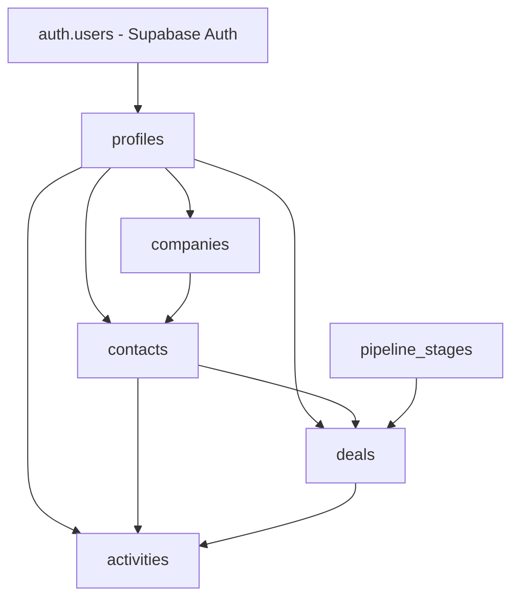
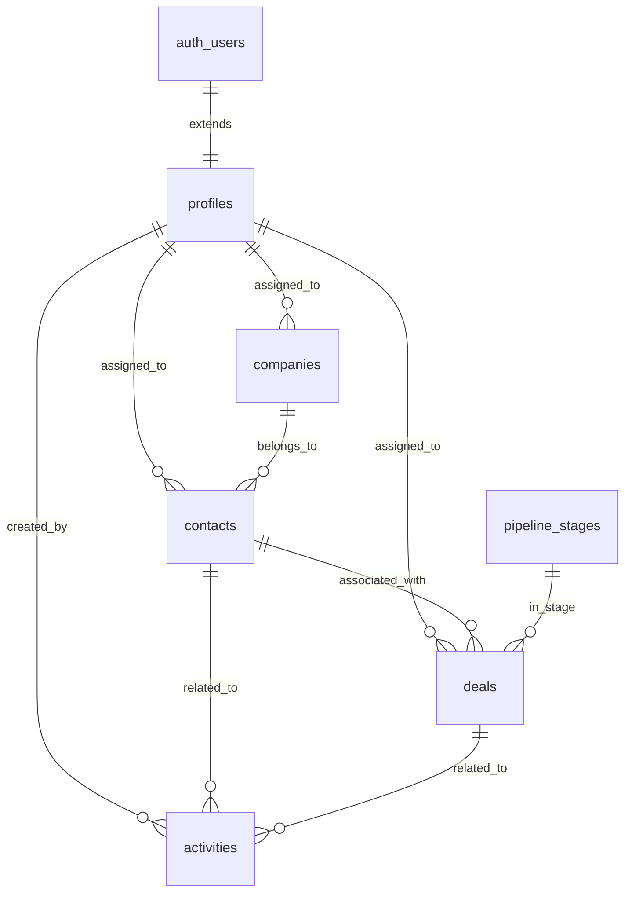

# Design Document: Supabase CRM Database Schema

## Overview

This design specifies a production-ready PostgreSQL database schema for a Supabase-based CRM system. The schema implements 6 core tables with comprehensive constraints, indexes, automatic timestamp management, and role-based access control through Row Level Security (RLS) policies.

The design produces a single executable SQL script compatible with Supabase SQL Editor, requiring no modifications for deployment. All tables follow consistent patterns for soft deletion, timestamp tracking, and foreign key relationships.

### Key Design Principles

1. **Referential Integrity**: All foreign keys use `ON DELETE RESTRICT` to prevent orphaned records
2. **Soft Deletion**: Tables use `deleted_at` timestamp for logical deletion without data loss
3. **Audit Trail**: Automatic `created_at` and `updated_at` timestamp management via triggers
4. **Role-Based Access**: RLS policies enforce data access based on user roles (admin, manager, sales)
5. **Performance Optimization**: Strategic indexes on foreign keys and frequently queried columns
6. **Supabase Integration**: Extends `auth.users` with CRM-specific profile data

## Architecture

### Database Layer Structure



### Table Dependency Order

The schema must be created in this order to satisfy foreign key dependencies:

1. `profiles` (references `auth.users`)
2. `companies` (references `profiles`)
3. `contacts` (references `companies`, `profiles`)
4. `pipeline_stages` (standalone)
5. `deals` (references `pipeline_stages`, `contacts`, `profiles`)
6. `activities` (references `contacts`, `deals`, `profiles`)

### Role-Based Access Model

- **Admin**: Full access to all records across all tables
- **Manager**: Access to records assigned to them or created by them
- **Sales**: Access to records assigned to them or created by them
- **All Users**: Read access to `pipeline_stages` and their own profile

## Components and Interfaces

### 1. Profiles Table

Extends Supabase authentication with CRM-specific user attributes.

**Schema:**
```sql
CREATE TABLE profiles (
  id UUID PRIMARY KEY REFERENCES auth.users(id) ON DELETE CASCADE,
  full_name TEXT NOT NULL,
  role TEXT NOT NULL CHECK (role IN ('admin', 'manager', 'sales')),
  avatar_url TEXT,
  created_at TIMESTAMPTZ NOT NULL DEFAULT NOW(),
  updated_at TIMESTAMPTZ NOT NULL DEFAULT NOW()
);
```

**Design Decisions:**
- Uses `auth.users(id)` as primary key for 1:1 relationship
- `ON DELETE CASCADE` ensures profile deletion when auth user is deleted
- Role constraint enforces valid values at database level
- No soft deletion (follows auth user lifecycle)

**Indexes:**
- Primary key index on `id` (automatic)

### 2. Companies Table

Tracks organizational entities with ownership assignment.

**Schema:**
```sql
CREATE TABLE companies (
  id UUID PRIMARY KEY DEFAULT gen_random_uuid(),
  name TEXT NOT NULL,
  industry TEXT,
  assigned_to UUID NOT NULL REFERENCES profiles(id) ON DELETE RESTRICT,
  created_at TIMESTAMPTZ NOT NULL DEFAULT NOW(),
  updated_at TIMESTAMPTZ NOT NULL DEFAULT NOW(),
  deleted_at TIMESTAMPTZ
);

CREATE INDEX idx_companies_assigned_to ON companies(assigned_to);
```

**Design Decisions:**
- `assigned_to` is NOT NULL to ensure ownership accountability
- `ON DELETE RESTRICT` prevents deletion of profiles with assigned companies
- Soft deletion via `deleted_at` preserves historical data
- Index on `assigned_to` optimizes user-specific queries

### 3. Contacts Table

Manages individual contacts with company affiliation and status tracking.

**Schema:**
```sql
CREATE TABLE contacts (
  id UUID PRIMARY KEY DEFAULT gen_random_uuid(),
  company_id UUID NOT NULL REFERENCES companies(id) ON DELETE RESTRICT,
  first_name TEXT NOT NULL,
  last_name TEXT NOT NULL,
  email TEXT NOT NULL,
  phone TEXT NOT NULL,
  status TEXT NOT NULL CHECK (status IN ('lead', 'customer', 'churned')),
  assigned_to UUID NOT NULL REFERENCES profiles(id) ON DELETE RESTRICT,
  created_at TIMESTAMPTZ NOT NULL DEFAULT NOW(),
  updated_at TIMESTAMPTZ NOT NULL DEFAULT NOW(),
  deleted_at TIMESTAMPTZ
);

CREATE INDEX idx_contacts_assigned_to ON contacts(assigned_to);
CREATE INDEX idx_contacts_status ON contacts(status);
```

**Design Decisions:**
- `company_id` is NOT NULL to enforce company association
- Status constraint enforces valid lifecycle states
- Dual indexes optimize filtering by owner and status
- Email and phone are NOT NULL to ensure contact methods exist

### 4. Pipeline Stages Table

Defines ordered sales pipeline stages with visual indicators.

**Schema:**
```sql
CREATE TABLE pipeline_stages (
  id UUID PRIMARY KEY DEFAULT gen_random_uuid(),
  name TEXT NOT NULL,
  "order" INTEGER NOT NULL UNIQUE,
  color TEXT NOT NULL,
  created_at TIMESTAMPTZ NOT NULL DEFAULT NOW(),
  updated_at TIMESTAMPTZ NOT NULL DEFAULT NOW()
);
```

**Design Decisions:**
- `order` column uses UNIQUE constraint to prevent duplicate positions
- Quoted `"order"` to avoid PostgreSQL reserved keyword conflict
- No soft deletion (pipeline stages are configuration data)
- No `assigned_to` (shared across all users)

### 5. Deals Table

Tracks sales opportunities with monetary value and pipeline position.

**Schema:**
```sql
CREATE TABLE deals (
  id UUID PRIMARY KEY DEFAULT gen_random_uuid(),
  title TEXT NOT NULL,
  value NUMERIC NOT NULL,
  stage_id UUID NOT NULL REFERENCES pipeline_stages(id) ON DELETE RESTRICT,
  contact_id UUID NOT NULL REFERENCES contacts(id) ON DELETE RESTRICT,
  assigned_to UUID NOT NULL REFERENCES profiles(id) ON DELETE RESTRICT,
  expected_close_date DATE,
  created_at TIMESTAMPTZ NOT NULL DEFAULT NOW(),
  updated_at TIMESTAMPTZ NOT NULL DEFAULT NOW(),
  deleted_at TIMESTAMPTZ
);

CREATE INDEX idx_deals_assigned_to ON deals(assigned_to);
CREATE INDEX idx_deals_stage_id ON deals(stage_id);
CREATE INDEX idx_deals_contact_id ON deals(contact_id);
```

**Design Decisions:**
- `value` uses NUMERIC for precise monetary calculations
- `expected_close_date` is nullable (may not be known initially)
- Triple indexes optimize common query patterns (by owner, stage, contact)
- All foreign keys use RESTRICT to maintain referential integrity

### 6. Activities Table

Logs interactions and tasks with completion tracking.

**Schema:**
```sql
CREATE TABLE activities (
  id UUID PRIMARY KEY DEFAULT gen_random_uuid(),
  type TEXT NOT NULL CHECK (type IN ('call', 'email', 'meeting', 'task')),
  subject TEXT NOT NULL,
  description TEXT,
  due_date TIMESTAMPTZ NOT NULL,
  completed_at TIMESTAMPTZ,
  contact_id UUID NOT NULL REFERENCES contacts(id) ON DELETE RESTRICT,
  deal_id UUID REFERENCES deals(id) ON DELETE RESTRICT,
  created_by UUID NOT NULL REFERENCES profiles(id) ON DELETE RESTRICT,
  created_at TIMESTAMPTZ NOT NULL DEFAULT NOW(),
  updated_at TIMESTAMPTZ NOT NULL DEFAULT NOW(),
  deleted_at TIMESTAMPTZ
);

CREATE INDEX idx_activities_contact_id ON activities(contact_id);
```

**Design Decisions:**
- `deal_id` is nullable (activities can exist without deals)
- `completed_at` is nullable (tracks completion status)
- Type constraint enforces valid activity categories
- Index on `contact_id` optimizes contact history queries
- `created_by` tracks activity author (different from `assigned_to` pattern)

## Data Models

### Entity Relationship Diagram



### Data Type Rationale

| Type | Usage | Rationale |
|------|-------|-----------|
| UUID | Primary keys, foreign keys | Globally unique, secure, Supabase standard |
| TEXT | Names, emails, descriptions | Variable length, no arbitrary limits |
| NUMERIC | Deal values | Precise decimal arithmetic for currency |
| TIMESTAMPTZ | Timestamps | Timezone-aware, UTC storage |
| DATE | Expected close dates | Date-only precision |

### Constraint Strategy

**CHECK Constraints:**
- Enforce enumerated values at database level
- Prevent invalid data entry
- Applied to: `role`, `status`, `type`

**UNIQUE Constraints:**
- Enforce business rules (e.g., unique pipeline stage order)
- Prevent duplicate configuration

**NOT NULL Constraints:**
- Enforce required fields
- Prevent incomplete records
- Applied to all core business fields

**Foreign Key Constraints:**
- All use `ON DELETE RESTRICT` to prevent orphaned records
- Require explicit cleanup before deletion
- Maintain referential integrity

## Automatic Timestamp Management

### Trigger Function

```sql
CREATE OR REPLACE FUNCTION update_updated_at_column()
RETURNS TRIGGER AS $$
BEGIN
  NEW.updated_at = NOW();
  RETURN NEW;
END;
$$ LANGUAGE plpgsql;
```

### Trigger Application

Triggers are created for all tables with `updated_at` columns:

```sql
CREATE TRIGGER update_profiles_updated_at
  BEFORE UPDATE ON profiles
  FOR EACH ROW
  EXECUTE FUNCTION update_updated_at_column();

CREATE TRIGGER update_companies_updated_at
  BEFORE UPDATE ON companies
  FOR EACH ROW
  EXECUTE FUNCTION update_updated_at_column();

-- (Similar triggers for contacts, pipeline_stages, deals, activities)
```

**Design Rationale:**
- Automatic timestamp updates eliminate manual errors
- Consistent audit trail across all tables
- Trigger executes before update to ensure NEW row has correct timestamp
- Single reusable function reduces code duplication

## Row Level Security (RLS) Policies

### Policy Architecture

RLS policies enforce role-based access control at the database level, independent of application logic.

### Profiles Table Policies

```sql
ALTER TABLE profiles ENABLE ROW LEVEL SECURITY;

-- All authenticated users can read their own profile
CREATE POLICY "Users can view own profile"
  ON profiles FOR SELECT
  USING (auth.uid() = id);

-- Admins can view all profiles
CREATE POLICY "Admins can view all profiles"
  ON profiles FOR SELECT
  USING (
    EXISTS (
      SELECT 1 FROM profiles
      WHERE id = auth.uid() AND role = 'admin'
    )
  );
```

### Companies Table Policies

```sql
ALTER TABLE companies ENABLE ROW LEVEL SECURITY;

-- Admins can view all companies
CREATE POLICY "Admins can view all companies"
  ON companies FOR SELECT
  USING (
    EXISTS (
      SELECT 1 FROM profiles
      WHERE id = auth.uid() AND role = 'admin'
    )
  );

-- Users can view companies assigned to them
CREATE POLICY "Users can view assigned companies"
  ON companies FOR SELECT
  USING (assigned_to = auth.uid());
```

### Contacts Table Policies

```sql
ALTER TABLE contacts ENABLE ROW LEVEL SECURITY;

-- Admins can view all contacts
CREATE POLICY "Admins can view all contacts"
  ON contacts FOR SELECT
  USING (
    EXISTS (
      SELECT 1 FROM profiles
      WHERE id = auth.uid() AND role = 'admin'
    )
  );

-- Users can view contacts assigned to them
CREATE POLICY "Users can view assigned contacts"
  ON contacts FOR SELECT
  USING (assigned_to = auth.uid());
```

### Pipeline Stages Table Policies

```sql
ALTER TABLE pipeline_stages ENABLE ROW LEVEL SECURITY;

-- All authenticated users can view pipeline stages
CREATE POLICY "All users can view pipeline stages"
  ON pipeline_stages FOR SELECT
  USING (auth.uid() IS NOT NULL);
```

### Deals Table Policies

```sql
ALTER TABLE deals ENABLE ROW LEVEL SECURITY;

-- Admins can view all deals
CREATE POLICY "Admins can view all deals"
  ON deals FOR SELECT
  USING (
    EXISTS (
      SELECT 1 FROM profiles
      WHERE id = auth.uid() AND role = 'admin'
    )
  );

-- Users can view deals assigned to them
CREATE POLICY "Users can view assigned deals"
  ON deals FOR SELECT
  USING (assigned_to = auth.uid());
```

### Activities Table Policies

```sql
ALTER TABLE activities ENABLE ROW LEVEL SECURITY;

-- Admins can view all activities
CREATE POLICY "Admins can view all activities"
  ON activities FOR SELECT
  USING (
    EXISTS (
      SELECT 1 FROM profiles
      WHERE id = auth.uid() AND role = 'admin'
    )
  );

-- Users can view activities they created
CREATE POLICY "Users can view own activities"
  ON activities FOR SELECT
  USING (created_by = auth.uid());
```

**Policy Design Rationale:**
- Policies use `auth.uid()` to access current authenticated user
- Admin check uses subquery to verify role from profiles table
- Policies are SELECT-only (INSERT/UPDATE/DELETE policies would be added separately)
- Each policy is named descriptively for maintainability
- Policies enforce least-privilege access principle

## Seed Data Strategy

### Seed Data Purpose

Provides immediate test data for:
- Development environment setup
- Feature verification
- Demo scenarios
- Integration testing

### Seed Data Structure

**Profiles (3 users):**
- 1 admin user
- 2 sales users
- Uses hardcoded UUIDs for referential consistency

**Companies (3 records):**
- Distributed across sales users
- Varied industries

**Contacts (5 records):**
- Associated with companies
- Mix of statuses (lead, customer)
- Distributed across sales users

**Pipeline Stages (3 records):**
- Lead (order: 1)
- Proposal (order: 2)
- Won (order: 3)

**Deals (3 records):**
- Associated with contacts
- Distributed across pipeline stages
- Varied values and close dates

**Activities (5 records):**
- Mix of types (call, email, meeting, task)
- Some completed, some pending
- Associated with contacts and deals

### Seed Data Implementation

```sql
-- Insert profiles with hardcoded UUIDs
INSERT INTO profiles (id, full_name, role, avatar_url) VALUES
  ('a0eebc99-9c0b-4ef8-bb6d-6bb9bd380a11', 'Admin User', 'admin', NULL),
  ('b1eebc99-9c0b-4ef8-bb6d-6bb9bd380a22', 'Sales User One', 'sales', NULL),
  ('c2eebc99-9c0b-4ef8-bb6d-6bb9bd380a33', 'Sales User Two', 'sales', NULL);

-- Insert companies
INSERT INTO companies (name, industry, assigned_to) VALUES
  ('Acme Corporation', 'Technology', 'b1eebc99-9c0b-4ef8-bb6d-6bb9bd380a22'),
  ('Global Industries', 'Manufacturing', 'c2eebc99-9c0b-4ef8-bb6d-6bb9bd380a33'),
  ('Tech Innovations', 'Software', 'b1eebc99-9c0b-4ef8-bb6d-6bb9bd380a22');

-- (Additional INSERT statements for contacts, pipeline_stages, deals, activities)
```

**Design Decisions:**
- Hardcoded UUIDs ensure reproducible references
- Data represents realistic CRM scenarios
- Covers all enum values (roles, statuses, types)
- Demonstrates foreign key relationships

## Error Handling

### Database-Level Error Prevention

**Constraint Violations:**
- CHECK constraints return descriptive error messages
- Foreign key violations indicate missing referenced records
- UNIQUE violations indicate duplicate values

**NULL Violations:**
- NOT NULL constraints prevent incomplete records
- Error messages identify specific missing fields

**Type Mismatches:**
- PostgreSQL type system enforces data types
- UUID validation prevents invalid identifiers

### Application-Level Error Handling Recommendations

**Foreign Key Errors:**
- Verify referenced records exist before INSERT/UPDATE
- Provide user-friendly messages (e.g., "Selected user not found")

**Soft Deletion:**
- Filter `deleted_at IS NULL` in all queries
- Implement "restore" functionality by setting `deleted_at = NULL`

**RLS Policy Denials:**
- Return 403 Forbidden when policy blocks access
- Log policy violations for security monitoring

**Concurrent Updates:**
- Implement optimistic locking using `updated_at` comparison
- Retry logic for transient conflicts

## Testing Strategy

### Schema Validation Tests

**Objective:** Verify schema structure matches design specification

**Approach:**
1. Query `information_schema` tables to validate:
   - Table existence
   - Column names, types, and nullability
   - Constraint definitions
   - Index existence
2. Verify trigger function and trigger existence
3. Validate RLS policy definitions

**Example Test:**
```sql
-- Verify profiles table structure
SELECT column_name, data_type, is_nullable
FROM information_schema.columns
WHERE table_name = 'profiles'
ORDER BY ordinal_position;

-- Expected: id (uuid, NO), full_name (text, NO), role (text, NO), etc.
```

### Constraint Validation Tests

**Objective:** Verify constraints enforce business rules

**Test Cases:**
1. **CHECK Constraints:**
   - Attempt to insert invalid role value → expect error
   - Attempt to insert invalid status value → expect error
   - Attempt to insert invalid activity type → expect error

2. **UNIQUE Constraints:**
   - Attempt to insert duplicate pipeline stage order → expect error

3. **NOT NULL Constraints:**
   - Attempt to insert record with missing required field → expect error

4. **Foreign Key Constraints:**
   - Attempt to insert record with non-existent foreign key → expect error
   - Attempt to delete referenced record → expect error (ON DELETE RESTRICT)

**Example Test:**
```sql
-- Test invalid role constraint
INSERT INTO profiles (id, full_name, role)
VALUES (gen_random_uuid(), 'Test User', 'invalid_role');
-- Expected: ERROR: new row violates check constraint
```

### RLS Policy Tests

**Objective:** Verify role-based access control

**Test Cases:**
1. **Admin Access:**
   - Admin user queries all tables → expect all records visible

2. **Sales User Access:**
   - Sales user queries companies → expect only assigned companies
   - Sales user queries contacts → expect only assigned contacts
   - Sales user queries deals → expect only assigned deals
   - Sales user queries activities → expect only created activities

3. **Pipeline Stages Access:**
   - Any authenticated user queries pipeline_stages → expect all records

4. **Profile Access:**
   - User queries profiles → expect only own profile (unless admin)

**Test Approach:**
- Use Supabase client with different user contexts
- Execute queries and verify returned record counts
- Verify unauthorized records are not accessible

### Trigger Function Tests

**Objective:** Verify automatic timestamp updates

**Test Cases:**
1. **Insert Operations:**
   - Insert record → verify `created_at` and `updated_at` are set to current timestamp

2. **Update Operations:**
   - Update record → verify `updated_at` is updated to current timestamp
   - Verify `created_at` remains unchanged

**Example Test:**
```sql
-- Insert and capture timestamps
INSERT INTO companies (name, assigned_to)
VALUES ('Test Company', 'b1eebc99-9c0b-4ef8-bb6d-6bb9bd380a22')
RETURNING id, created_at, updated_at;

-- Wait 1 second, then update
SELECT pg_sleep(1);
UPDATE companies SET name = 'Updated Company' WHERE id = <captured_id>
RETURNING created_at, updated_at;

-- Verify: updated_at > created_at
```

### Integration Tests

**Objective:** Verify end-to-end workflows

**Test Scenarios:**
1. **User Onboarding:**
   - Create auth user → verify profile created
   - Assign companies to user → verify access via RLS

2. **Sales Pipeline:**
   - Create company → create contact → create deal → create activity
   - Verify all foreign key relationships
   - Verify soft deletion cascades logically

3. **Data Migration:**
   - Execute complete SQL script in fresh database
   - Verify all tables, indexes, triggers, and policies exist
   - Verify seed data inserted successfully

### Performance Tests

**Objective:** Verify query performance with indexes

**Test Cases:**
1. **Index Effectiveness:**
   - Query companies by `assigned_to` → verify index scan (not seq scan)
   - Query contacts by `status` → verify index scan
   - Query deals by `stage_id` → verify index scan

2. **Query Plans:**
   - Use `EXPLAIN ANALYZE` to verify index usage
   - Benchmark query times with and without indexes

**Example Test:**
```sql
EXPLAIN ANALYZE
SELECT * FROM companies WHERE assigned_to = 'b1eebc99-9c0b-4ef8-bb6d-6bb9bd380a22';
-- Expected: Index Scan using idx_companies_assigned_to
```

### Seed Data Validation Tests

**Objective:** Verify seed data integrity

**Test Cases:**
1. Verify 3 profiles inserted
2. Verify 3 companies inserted with valid `assigned_to` references
3. Verify 5 contacts inserted with valid `company_id` and `assigned_to` references
4. Verify 3 pipeline stages with correct order values (1, 2, 3)
5. Verify 3 deals with valid foreign key references
6. Verify 5 activities with valid foreign key references

**Example Test:**
```sql
-- Verify profile count
SELECT COUNT(*) FROM profiles;
-- Expected: 3

-- Verify all foreign keys are valid
SELECT COUNT(*) FROM companies c
LEFT JOIN profiles p ON c.assigned_to = p.id
WHERE p.id IS NULL;
-- Expected: 0 (no orphaned records)
```

### Test Execution Strategy

**Unit Tests:**
- Run constraint validation tests
- Run trigger function tests
- Execute in isolated transactions (rollback after each test)

**Integration Tests:**
- Run complete SQL script in test database
- Execute RLS policy tests with different user contexts
- Run seed data validation tests

**Performance Tests:**
- Run with production-like data volumes
- Monitor query execution times
- Verify index usage with EXPLAIN ANALYZE

**Continuous Integration:**
- Automate schema validation tests
- Run tests on every schema change
- Fail builds on constraint violations or missing indexes

## Complete SQL Script

The complete production-ready SQL script follows this structure:

1. **Create Tables** (in dependency order)
2. **Create Indexes**
3. **Create Trigger Function**
4. **Create Triggers** (one per table)
5. **Enable RLS** (one per table)
6. **Create RLS Policies** (multiple per table)
7. **Insert Seed Data** (in dependency order)

The script is designed to execute successfully in Supabase SQL Editor without modification. All statements are ordered to satisfy dependencies, and all syntax is PostgreSQL 14+ compatible.

See the complete SQL implementation in the accompanying `schema.sql` file.

---

## Design Review Checklist

- [x] All 10 requirements addressed
- [x] 6 tables defined with complete schemas
- [x] Foreign key relationships documented
- [x] Indexes specified for performance optimization
- [x] Trigger function and triggers defined
- [x] RLS policies specified for all tables
- [x] Seed data structure defined
- [x] Error handling strategy documented
- [x] Testing strategy comprehensive (schema, constraints, RLS, triggers, integration)
- [x] SQL execution order documented
- [x] Supabase compatibility ensured
